# Lab 00 — Lab Environment Setup

**Cisco Modeling Labs (CML-Free) on VMware Workstation Pro**
Chris Moody · CCNA 200-301 Study Plan · September 2026

---

## 1. Overview

This document records the setup of the hands-on lab environment used throughout the CCNA 200-301 study plan: Cisco Modeling Labs (CML), running the free CML-Free tier, hosted inside VMware Workstation Pro. It covers the full path from download to a verified, working two-router test topology, including the setup failure that came up along the way and how it was resolved. This is Lab 00 in the `ccna-labs` series — the same format (steps, screenshots, issues hit, commands run, what was learned) is reused for every lab that follows it.

### Environment Summary

| Component | Detail |
|---|---|
| Hypervisor | VMware Workstation Pro (free for personal/commercial use, no license key required) |
| Platform | Cisco Modeling Labs 2.10.0+build.13, CML-Free tier (5-node limit, no expiry) |
| Guest OS | Ubuntu 24.04.4 LTS (cml-controller) |
| Deployment files | `cml2_f_2.10.0-13_amd64-17.ova` + `refplat-20260409-free-iso.zip` |
| Network mode | DHCP (bridged) |
| Optional services | OpenSSH, PATty, MCPServer — all left disabled at install |
| Node images available | Alpine, ASAv, Desktop, IOL XE, IOL L2 XE, IOSv, IOSv L2, Server TCL, Ubuntu, Wireless AP/Client |

---

## 2. Setup Steps

### 2.1 Download CML-Free

Registered for CML-Free (no cost, single-user, 5-node cap, community-supported, no expiration) and downloaded two files from the Cisco/Broadcom software portal:

- `cml2_f_2.10.0-13_amd64-17.ova` — the CML server image built for VMware deployment
- `refplat-20260409-free-iso.zip` — the reference platform images (required to get any router/switch node types — extract this before use, the `.iso` inside is what actually gets mounted, not the `.zip` itself)

The bare-metal installer file (`cml2_f_2.10.0-13_amd64-17-iso.zip`) was not needed since deployment was to a VM, not physical hardware.

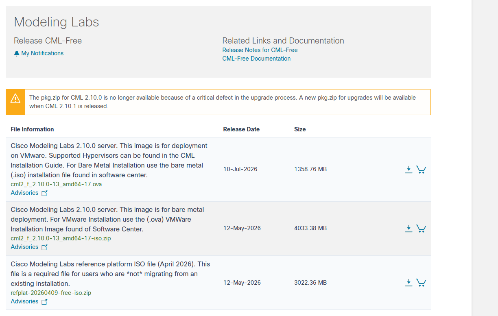
*Figure 1 — CML-Free download page*

### 2.2 Install VMware Workstation Pro (free)

VMware Workstation Pro is now free for personal, educational, and commercial use as of Broadcom's licensing change — no license key required.

- Created a free Broadcom account at profile.broadcom.com/web/registration
- Downloaded Workstation Pro from support.broadcom.com
- Installed with default settings; ignored the 3D-acceleration warning (not needed for CML)
- Confirmed hardware virtualization (Intel VT-x) was enabled in BIOS before proceeding

### 2.3 Import the CML OVA

File → Open in VMware Workstation, selected the `.ova`, and imported it as a new VM. Powered on the VM to begin initial system configuration.

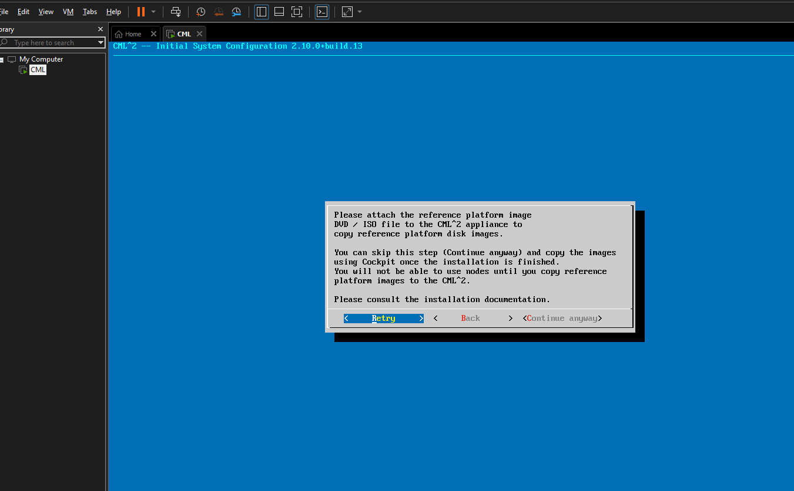
*Figure 2 — Initial System Configuration*

### 2.4 Attach the Reference Platform Image

During Initial System Configuration, CML prompts for the reference platform ISO before it will copy any node images. This step can be skipped and completed later via Cockpit, but doing it during setup avoids an extra manual step afterward.

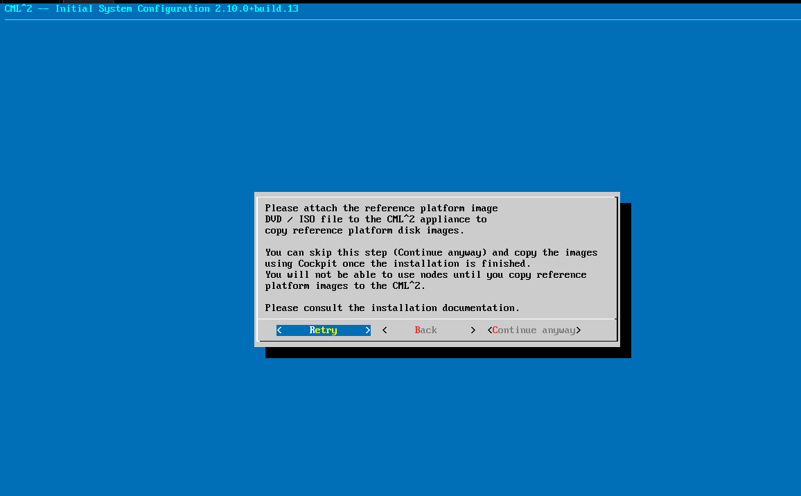
*Figure 3 — Reference platform prompt*

To attach it: **VM → Settings → CD/DVD device → "Use ISO image file"** → point to the extracted `.iso` (not the `.zip`) → check **"Connected"** and **"Connect at power on"** → Retry.

### 2.5 Network Configuration

Left the primary interface on DHCP rather than setting a static IP. A static address (or any other network tuning) can be set later through Cockpit on port 9090 if ever needed — no reason to complicate first setup.

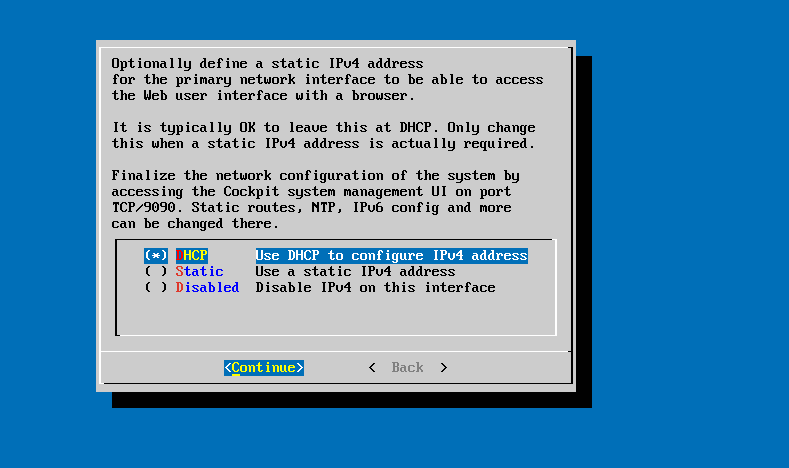
*Figure 4 — Network configuration*

### 2.6 Optional Services

All three optional services were left unchecked at this stage — none are required to get CML working, and all three can be turned on individually later in Cockpit if a specific need comes up:

- **OpenSSH** — SSH access to the CML host itself, port 1122
- **PATty** — port forwarding for direct console/SSH access into individual lab nodes
- **MCPServer** — exposes an MCP interface for LLM-driven lab automation

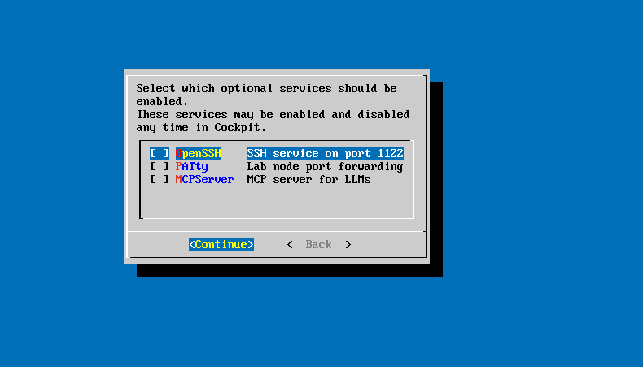
*Figure 5 — Optional services*

---

## 3. Issue Encountered: Failed Initial Setup

The first install attempt failed partway through first boot.

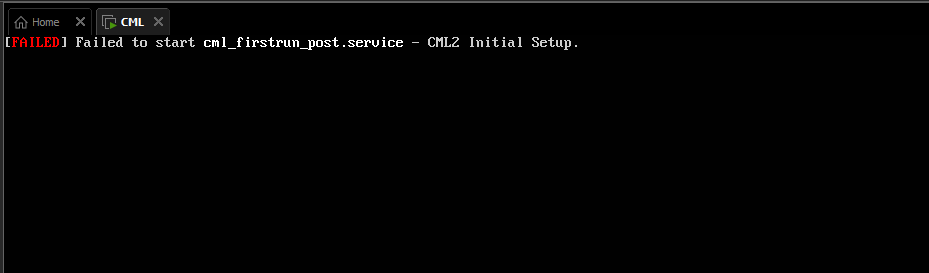
*Figure 6 — Failed firstrun service*

Attempting to log in at the console produced no response — a blinking cursor with no login prompt, even after waiting 60–90 seconds and pressing Enter. This indicated the boot sequence had genuinely halted after the failed unit, rather than continuing on to a shell.

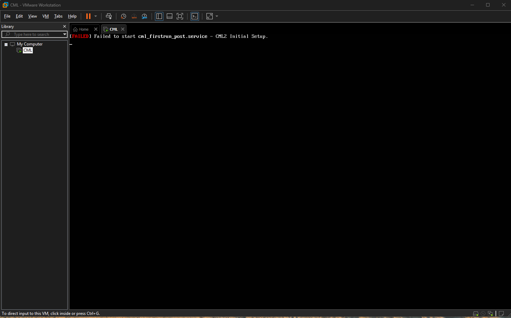
*Figure 7 — Hung console after failure*

A second attempt to attach the reference platform ISO (this time before first boot) still produced the same "please attach the reference platform image" prompt, suggesting CML was not detecting the mounted ISO at all on this VM instance.

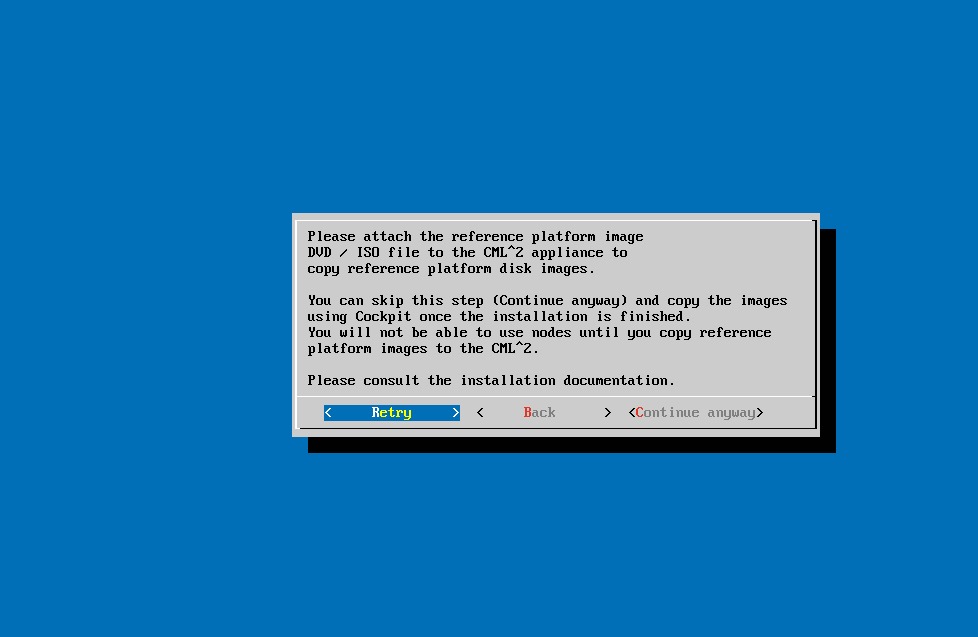
*Figure 8 — Reference platform prompt recurring*

### Root Cause & Resolution

Rather than continuing to debug a first-boot sequence that had already failed and hung, the faster and more reliable path was a clean reinstall:

- Powered off the VM completely (not suspended)
- Removed it from VMware Workstation's library, deleting the associated files
- Re-imported the OVA fresh
- This time, extracted the reference platform `.zip` first and attached the resulting `.iso` via VM → Settings before ever powering on the VM
- Confirmed the CD/DVD device showed "Connected" before boot, rather than attaching it reactively mid-setup

The clean reinstall completed successfully on the first attempt with the ISO pre-attached, producing a full boot with no failed units.

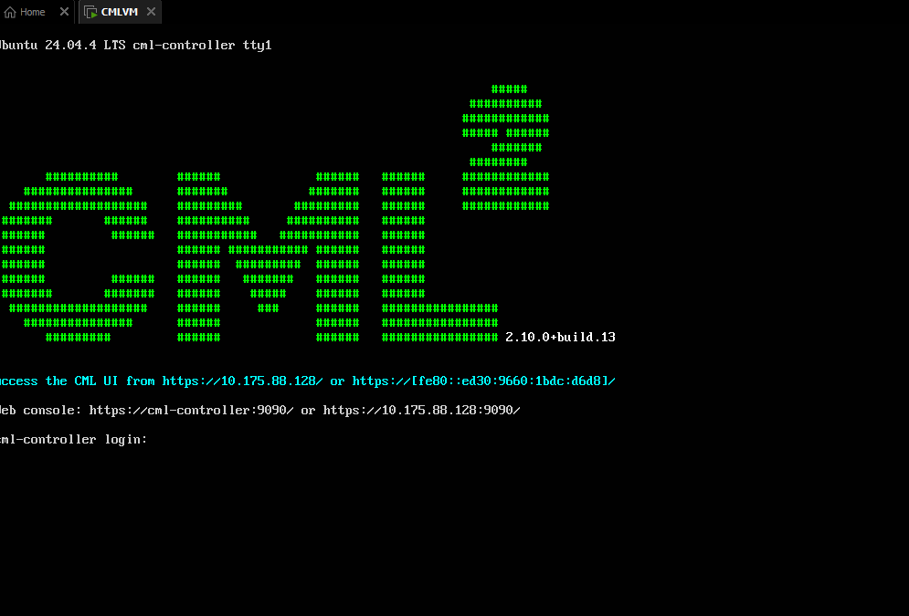
*Figure 9 — Successful boot banner*

> **Lesson for future installs:** attach the reference platform ISO in VM Settings and confirm it shows Connected before the very first power-on, rather than attaching it reactively during the setup wizard. This avoids the retry/detection issue entirely.

---

## 4. First Login & Image Verification

The boot banner on successful setup displays the exact URLs needed to reach both the CML web UI and Cockpit — no need to guess or look up an IP separately:

```
Access the CML UI from https://10.175.88.128/
Web console: https://cml-controller:9090/ or https://10.175.88.128:9090/
```

> **Note:** the console login prompt (`cml-controller login:`) uses the Linux **sysadmin** account, which is separate from the CML web UI's **admin** account. The web UI is the one actually needed for day-to-day lab work — the console is only relevant for low-level troubleshooting.

Logged into the web UI with the admin credentials set during the setup wizard, then checked **Tools → Node Definitions → Image Definitions** to confirm the reference platform images had copied successfully:

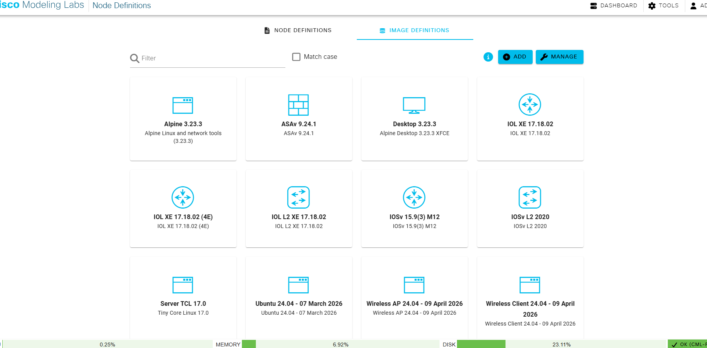
*Figure 10 — Image Definitions confirmed*

All expected images were present — IOSv 15.9(3) M12, IOSv L2, IOL XE 17.18.02 (plus the 4-Ethernet variant), IOL L2 XE, ASAv 9.24.1, Alpine, Desktop, Server TCL, Ubuntu, and the Wireless AP/Client platforms. The status bar also confirmed licensing was recognized correctly as **OK (CML-Free)**.

---

## 5. Building the Test Topology

With the environment verified, built a minimal two-node topology to confirm the full stack works end-to-end (VMware → CML → node images → networking) before starting real coursework labs.

### 5.1 Workbench

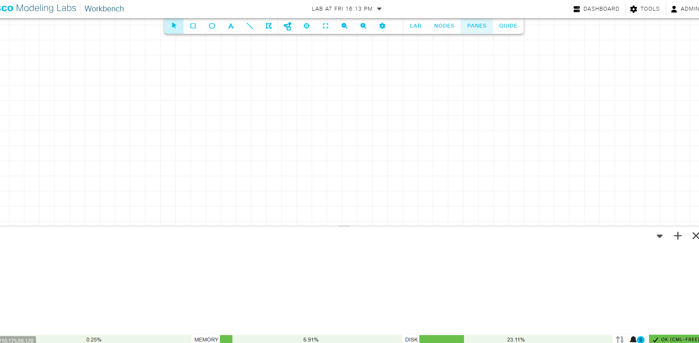
*Figure 11 — Blank workbench*

### 5.2 Placing and Linking Nodes

Dragged two IOSv nodes onto the canvas from the Nodes panel. **Note:** a freehand line drawn between two nodes on the canvas does not necessarily create a real link — CML confirms a real connection via an explicit "Select source and target interfaces" dialog, which must be completed and confirmed with Create Link.

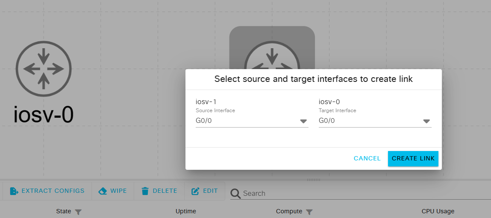
*Figure 12 — Create Link dialog*

Linked iosv-1 G0/0 to iosv-0 G0/0, then started both nodes.

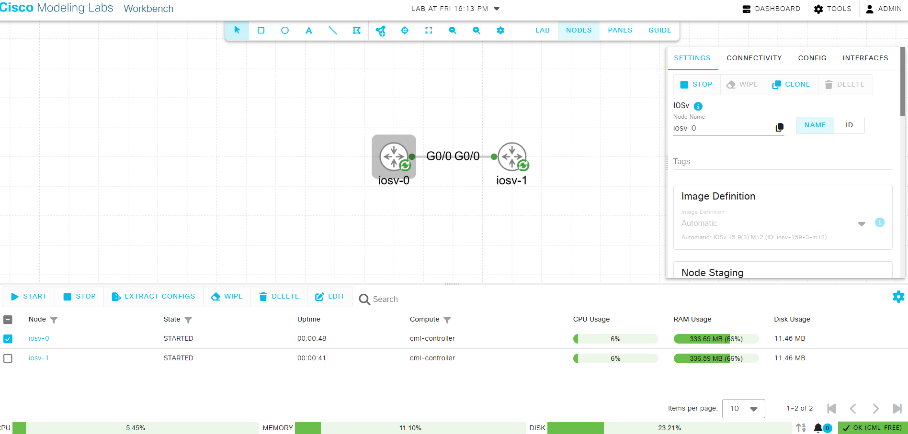
*Figure 13 — Both nodes started*

### 5.3 Opening the Console

A common point of confusion: clicking a node opens its **Settings** panel (properties, image definition, staging), not a console. The actual console is reached via the **Connectivity** tab, or by clicking the node's name link in the node table at the bottom of the workbench.

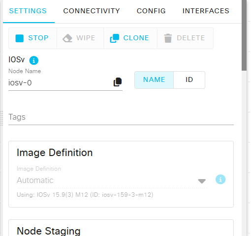
*Figure 14 — Settings tab is not the console*

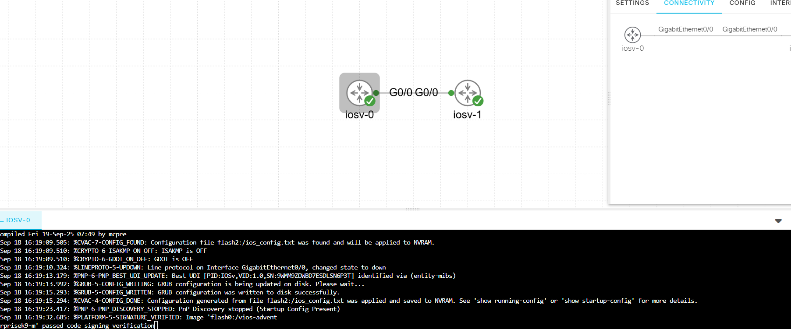
*Figure 15 — Console boot log*

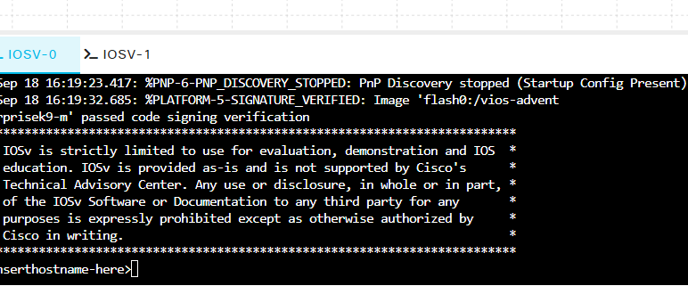
*Figure 16 — Ready for configuration*

### 5.4 Interface Configuration

Configured on iosv-0:

```
enable
configure terminal
interface g0/0
ip address 10.0.0.1 255.255.255.0
no shutdown
end
```

Configured on iosv-1 (identical, except the IP address):

```
enable
configure terminal
interface g0/0
ip address 10.0.0.2 255.255.255.0
no shutdown
end
```

Both interfaces reported `%LINEPROTO-5-UPDOWN: ...changed state to up` after `no shutdown`, confirming the link was real and active on both ends.

---

## 6. Connectivity Verification

From iosv-0:

```
ping 10.0.0.2
```

First attempt: 4/5 (80%) success — the first packet dropped, which is expected behavior. The initial ping in a sequence commonly fails while the router performs ARP resolution for the destination's MAC address before the first ICMP packet can actually be sent; once the ARP entry is cached, subsequent pings succeed normally. A second ping immediately after returned 5/5.

**Result:** Full end-to-end connectivity confirmed — VMware → CML → IOSv images → configured link → IP reachability. Environment is verified working.

---

## 7. What I Learned

- CML-Free is a genuinely capable free tier: full feature set, no expiry, just a 5-node concurrent cap (unmanaged switches and external connectors don't count against it).
- VMware Workstation Pro is free for all use now — no license key, just a Broadcom account.
- Reference platform images must be attached and confirmed Connected before first power-on, not attached reactively mid-setup — doing it reactively caused a failed `cml_firstrun_post.service` and a hung boot that required a clean reinstall rather than a simple retry.
- A drawn line between two nodes on the canvas is not automatically a real link — CML requires explicitly selecting source/target interfaces and confirming with Create Link. Click the link line and check for interface labels on both ends to verify.
- Clicking a node opens its Settings panel by default — the console lives under the **Connectivity** tab or via the node name link in the bottom table, not from the Settings view.
- A single dropped first ping (ARP resolution delay) is normal router behavior on a freshly configured link, not a fault — worth remembering before assuming a link is broken.
- Console login (**sysadmin**) and web UI login (**admin**) are two separate credential sets set during the same setup wizard — don't conflate them when troubleshooting a failed login.

---

## 8. Quick Reference

| Command | Purpose |
|---|---|
| `show ip interface brief` | Check interface status/IP on a router (up/up = working link) |
| `show mac address-table` | View learned MAC addresses on a switch |
| `ping <ip>` | Basic Layer 3 reachability test |
| `enable` | Enter privileged EXEC mode |
| `configure terminal` | Enter global configuration mode |
| `interface g0/0` | Enter interface configuration mode |
| `no shutdown` | Activate an interface (interfaces are shut down by default) |

---

## 9. Next Lab

**Lab 01 — Switch Fundamentals** (Weeks 1–2): 3-node topology — two Alpine hosts connected through an IOL L2 / IOSv L2 switch. Focus: MAC addressing, switch MAC-address-table learning, and mapping observed behavior to the TCP/IP and OSI layer concepts.
