# Lab 01 — Switch Fundamentals

**Two Alpine Hosts Through an IOL-L2 Switch — MAC Learning Verification**
Chris Moody · CCNA 200-301 Study Plan — Weeks 1–2 · September 2026

---

## 1. Overview

This lab builds on Lab 00's verified CML environment and covers TCP/IP model and Ethernet/MAC addressing concepts plus the core Week 2 switching mechanic: dynamic MAC address learning. Two Alpine Linux hosts were connected through a Cisco IOL-L2 switch, addressed, and tested for Layer 2/3 connectivity, with the switch's MAC address table used as the concrete verification that switching concepts from the text are actually happening on the wire.

### Topology

```
alpine-0 (192.168.1.10/24) — Et0/0 — iol-l2-0 — Et0/1 — alpine-1 (192.168.1.11/24)
```

### Environment Summary

| Component | Detail |
|---|---|
| Hosts | 2x Alpine Linux (default creds: `cisco` / `cisco`) |
| Switch | 1x IOL-L2 (Cisco IOS switch image) |
| Host addressing | 192.168.1.10/24 and 192.168.1.11/24, assigned manually (no DHCP on Alpine in this lab) |
| Node budget used | 3 of 5 (CML-Free) — 2 remaining for future expansion |
| Concepts verified | MAC addressing, ARP resolution, dynamic MAC address-table learning, Layer 2 vs Layer 3 distinction |

---

## 2. Building the Topology

### 2.1 Placing the Nodes

Added alpine-0, alpine-1, and iol-l2-0 from the Nodes panel. All three start in a stopped state until explicitly started.

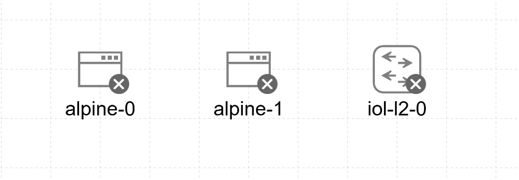
*Figure 1 — Nodes placed*

### 2.2 Connecting the Nodes

Order followed: place nodes → connect them while stopped → start last. Links are created by dragging from a node's edge (not its label) to the target node, which opens a source/target interface selection dialog rather than a plain drawn line — a plain freehand line on the canvas is not a real link until this dialog is confirmed.

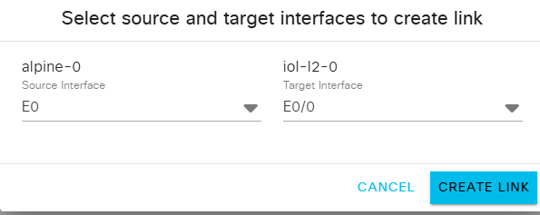
*Figure 2 — Create Link dialog*

Linked alpine-0 (E0) to iol-l2-0 (E0/0), and alpine-1 (E0) to iol-l2-0 (E0/1) — each host to its own distinct switch port. Started all three nodes together.

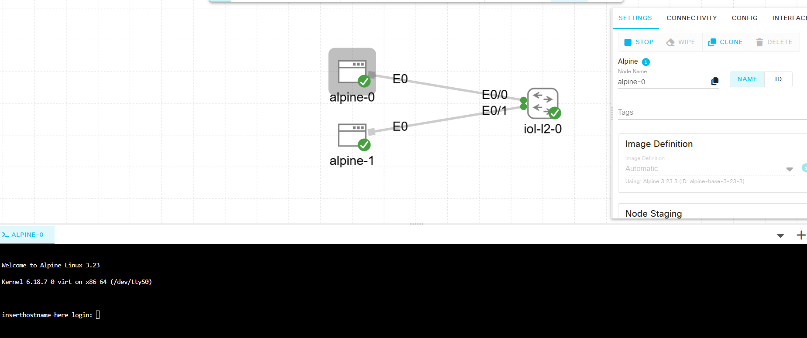
*Figure 3 — Fully wired topology*

---

## 3. Host Login

CML's built-in Alpine node images use a fixed default login, distinct from both the CML web UI admin account and the CML host's own sysadmin account:

```
username: cisco
password: cisco
```

---

## 4. IP Configuration — First Attempts

Assigning an address on a fresh Alpine host requires `sudo` — the default `cisco` user is not root, and `ip addr add` fails silently with "Operation not permitted" without it. Working through this produced a few instructive typos along the way:

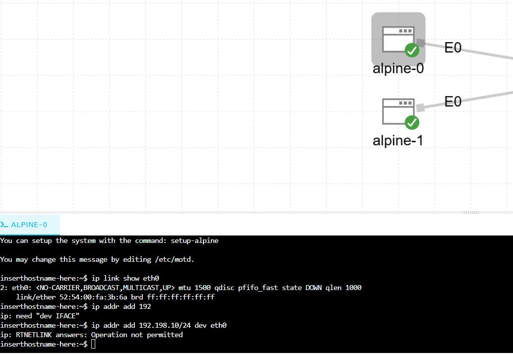
*Figure 4 — First login and command typos*

- `ip addr add 192` — incomplete address, missing the interface argument
- `ip addr add 192.198.10/24 dev eth0` (no `sudo`) — correctly formed but rejected: `Operation not permitted`

Corrected command:

```
sudo ip addr add 192.168.1.10/24 dev eth0
sudo ip link set eth0 up
```

A later attempt left a stray address from an earlier typo (`192.168.10.0/24`) still attached alongside the correct one — cleaned up with:

```
sudo ip addr del 192.168.10.0/24 dev eth0
```

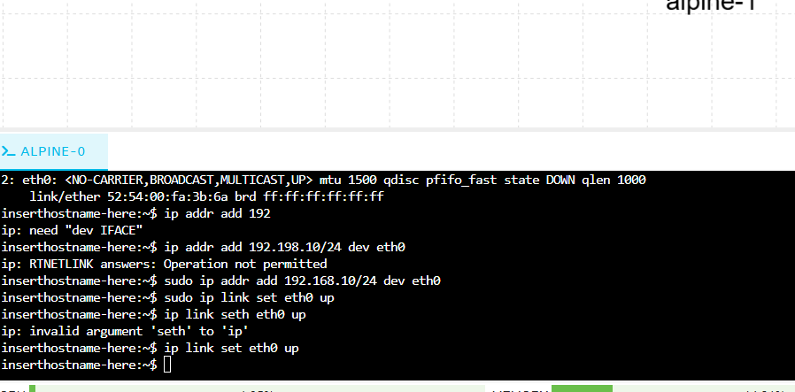
*Figure 5 — Stray address cleanup*

---

## 5. Issue Encountered: Persistent NO-CARRIER

Even with the correct address assigned and the interface administratively up, `eth0` continued to show `NO-CARRIER` / `state DOWN` — meaning Linux detected no live signal on the wire at all, independent of IP configuration.

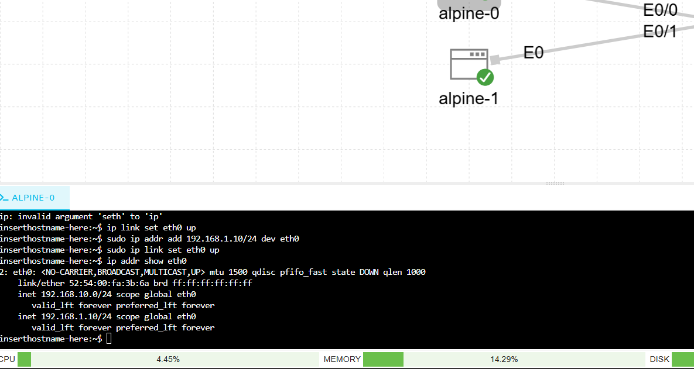
*Figure 6 — Persistent NO-CARRIER*

### 5.1 Ruled Out: Switch Ports Down

Checked iol-l2-0 directly — all four Ethernet ports (Et0/0–0/3) reported up/up, both administratively and at the line-protocol level. This ruled out the simplest explanation (switch ports shut down by default).

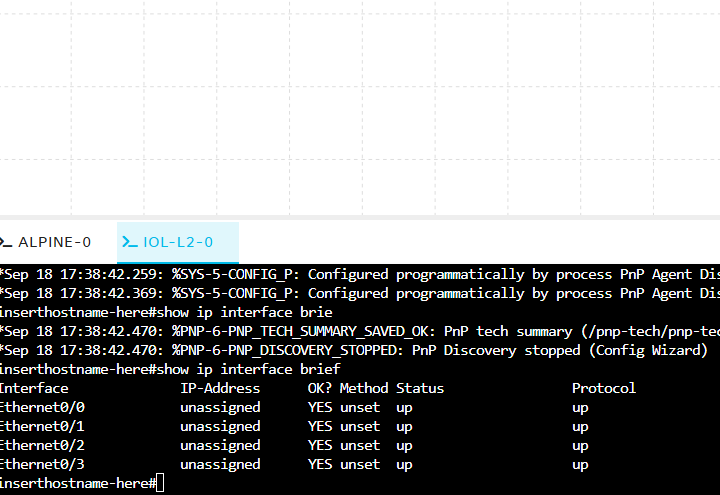
*Figure 7 — Switch ports confirmed up*

### 5.2 Ruled Out: Reboot-Related State Loss

A reboot of alpine-0 (from an earlier stop/start cycle) cleared the manually-assigned IP as expected — `ip addr add` does not persist across reboots — but `NO-CARRIER` remained even before any IP was reapplied, confirming this was a link-level issue, not an IP configuration issue.

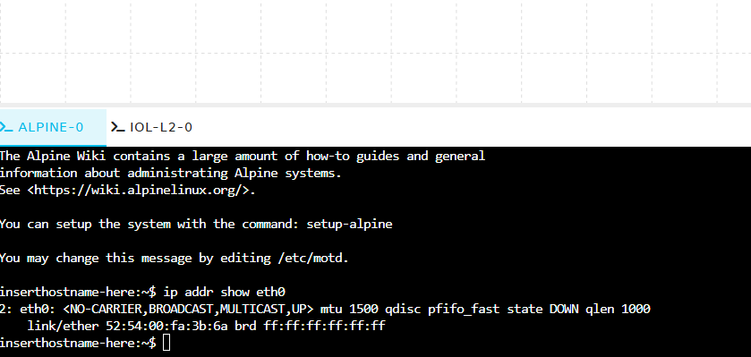
*Figure 8 — State lost after reboot*

### 5.3 Ruled Out: Interface Mismatch

Checked the node's **Interfaces** tab in the CML UI to confirm `eth0` was actually mapped to the intended switch port. It was — `eth0` correctly tied to `Ethernet0/0` on iol-l2-0 — ruling out a wiring/mapping error.

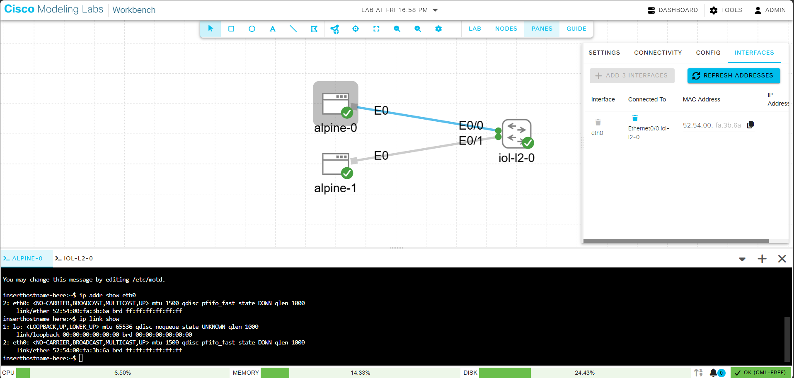
*Figure 9 — Interface mapping confirmed*

### 5.4 Ruled Out: Timing / Boot Order

A full lab restart (all three nodes stopped and started together, to force simultaneous link renegotiation) did not clear the issue.

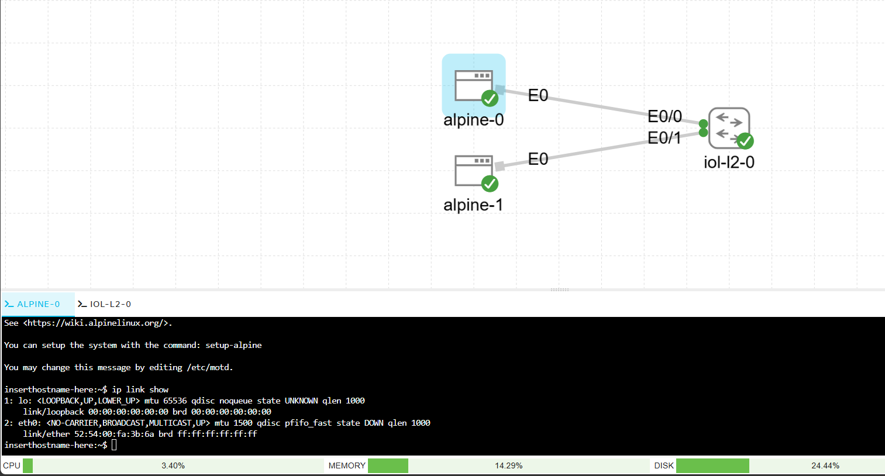
*Figure 10 — Persists after full restart*

Checked alpine-1 as a control — it showed the identical `NO-CARRIER` symptom, confirming the problem was systemic to the topology rather than isolated to alpine-0 specifically.

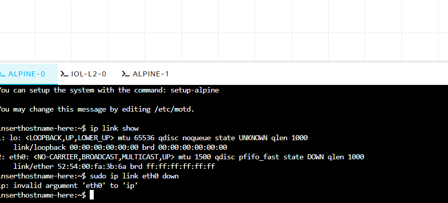
*Figure 11 — alpine-1 shows the same symptom*

### 5.5 Root Cause: Per-Side Link Activation

The actual cause: clicking directly on the link line itself (not either node) opens a **Link Statistics** panel showing an independent "Running" toggle for each side of the link. alpine-0's side (eth0) was toggled off while iol-l2-0's side (Ethernet0/0) was toggled on — the link was only half-active. This is a per-link, per-endpoint state that is separate from whether the nodes themselves are running, and it does not always activate automatically.

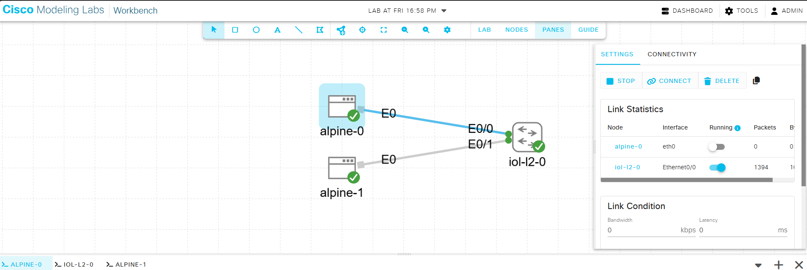
*Figure 12 — Root cause: per-side link toggle*

Both alpine-0's and alpine-1's link toggles required manual activation. Once flipped, `eth0` immediately reported UP with `LOWER_UP` present, confirming carrier detection.

> **Lesson for future labs:** if an interface shows `NO-CARRIER` despite correct IP configuration, correct interface mapping, and the far-end device reporting its port as up, check the link itself — click the link line on the canvas and confirm both sides' Running toggle in Link Statistics, not just the two endpoint nodes.

---

## 6. Connectivity Verification

With both link toggles activated and addresses reapplied (192.168.1.10/24 on alpine-0, 192.168.1.11/24 on alpine-1), tested reachability from alpine-0:

```
ping 192.168.1.11
```

**Note:** Alpine's BusyBox `ping` runs continuously by default (unlike IOS, which auto-stops after 5 packets) — Ctrl+C is needed to stop it manually. Successful, continuous replies confirmed full Layer 3 reachability across the switch.

---

## 7. MAC Address Table Verification

On iol-l2-0:

```
enable
show mac address-table
```

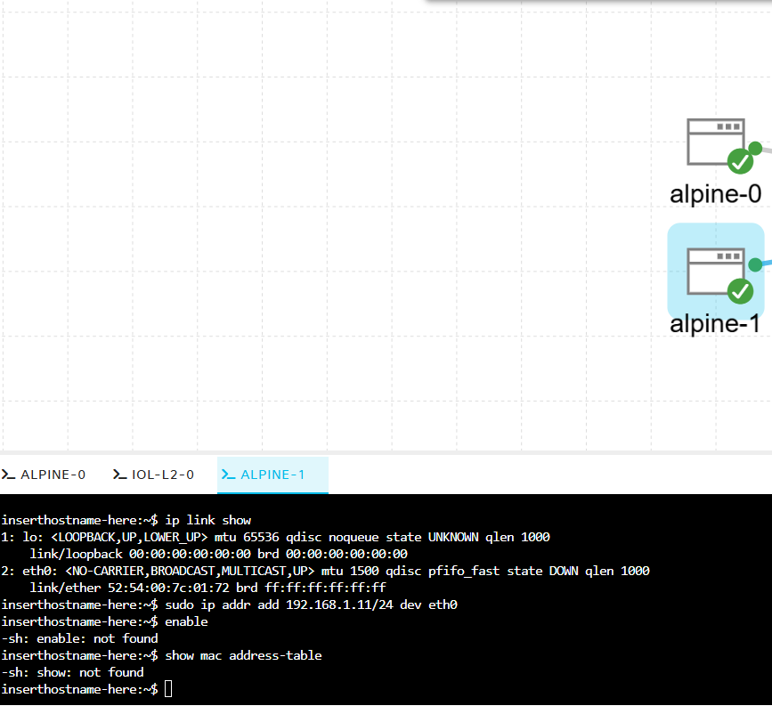
*Figure 13 — MAC address table verified*

Result: both hosts' MAC addresses appear under VLAN 1 (the default), each tied to the correct port — learned dynamically from the ping traffic, with no manual configuration on the switch:

| MAC Address | Port |
|---|---|
| 5254.00fa.3b6a | Et0/0 (alpine-0) |
| 5254.007c.0172 | Et0/1 (alpine-1) |

This is the concrete mechanism behind switching: the switch did not know either address in advance — it learned each MAC-to-port mapping purely by observing source addresses on incoming frames. Before this table populates, a switch floods unknown-destination traffic out every port; once populated, it forwards intelligently instead. This same mechanism underlies the VLAN and STP material in later labs.

---

## 8. What I Learned

- Order of operations that works reliably: place nodes → connect while stopped → start last.
- A drawn line on the canvas is not a real link until confirmed via the source/target interface dialog.
- CML's built-in Alpine images use `cisco`/`cisco` as the default login — separate from both the CML web UI admin account and the host's own sysadmin account.
- `ip addr add` and `ip link set` require `sudo` on Alpine's default `cisco` user; omitting it fails silently with a permissions error rather than an obvious "access denied."
- `ip addr add` does not persist across a node reboot — expect to reapply host IPs after any stop/start cycle during troubleshooting.
- A switch reporting `show ip interface brief` as up/up does not guarantee the link to a connected host is actually live — this specific behavior is documented by Cisco for IOL-based node types.
- The single most useful troubleshooting step for a persistent `NO-CARRIER`: click the link line itself (not the nodes) and check the per-side **Running** toggle in Link Statistics — this is state that is independent of both endpoints' running status.
- Alpine's `ping` runs continuously (BusyBox behavior) unlike IOS's 5-packet default — Ctrl+C to stop.
- A populated MAC address table with the correct MAC-to-port pairing is the clearest concrete proof that Layer 2 switching/learning is functioning as described in the text.

---

## 9. Quick Reference

| Command | Purpose |
|---|---|
| `sudo ip addr add <ip>/<mask> dev eth0` | Assign an IP address to an interface (Alpine/Linux) |
| `sudo ip link set eth0 up` | Administratively activate an interface (Alpine/Linux) |
| `ip addr show eth0` | Check interface state, carrier, and assigned addresses |
| `ip link show` | List all interfaces on the host |
| `ping <ip>` | Basic reachability test (Ctrl+C to stop on Alpine) |
| `arp -a` | View the host's IP-to-MAC cache |
| `show ip interface brief` | Check interface up/down status on a Cisco device |
| `show mac address-table` | View learned MAC-to-port mappings on a switch |

---

## 10. Next Lab

**Lab 02 — VLANs and Trunking** (Week 3): extend this topology with a second switch and configure trunking between them, moving alpine-0 and alpine-1 into separate VLANs to observe broadcast domain segmentation directly.
