# Lab 02 — VLANs and Trunking

**802.1Q Trunking Between Two Switches — VLAN Segmentation Verification**
Chris Moody · CCNA 200-301 Study Plan — Week 3 · September 2026

---

## 1. Overview

This lab extends the switching fundamentals from Lab 01 into VLAN segmentation and trunking. Two switches were connected by a single physical trunk link carrying two VLANs, each hosting one Alpine Linux host. The lab demonstrates that Layer 2 reachability is governed by VLAN membership rather than physical wiring: identical cabling produced no connectivity between hosts in different VLANs, and full connectivity once both hosts were moved into the same VLAN.

### Topology

```
alpine-0 (VLAN 10, 192.168.1.10/24) — G0/0 — iosvl2-0 === G0/1 trunk G0/1 === iosvl2-1 — G0/0 — alpine-1 (192.168.1.11/24)
```

### Environment Summary

| Component | Detail |
|---|---|
| Hosts | 2x Alpine Linux (default creds: `cisco` / `cisco`) |
| Switches | 2x IOSv L2 2020 (interfaces named `GigabitEthernet0/x`, not `Ethernet0/x`) |
| VLANs | VLAN 10 (Sales), VLAN 20 (Engineering) — created identically on both switches |
| Trunk | G0/1 on each switch, 802.1Q encapsulation, carrying VLANs 1, 10, 20 |
| Node budget used | 4 of 5 (CML-Free) |
| Concepts verified | VLAN creation, access port assignment, 802.1Q trunking, VLAN-based broadcast domain segregation, STP port-state convergence delay |

---

## 2. Note: Environment Rebuild

Partway through this lab, the CML admin account password could not be recalled and the sysadmin console login also failed. Rather than attempt a GRUB-level Linux password reset — an approach with its own risk given prior console keyboard-capture issues in this environment — the CML VM was cleanly reimported from the original `.ova`, the same reliable process used to recover from Lab 00's failed first install. This reset all lab data, so the topology and VLAN configuration below were rebuilt from scratch. Both the sysadmin and admin passwords were recorded immediately during the new setup wizard to prevent a repeat.

One side effect of the rebuild: the replacement switch nodes defaulted to IOSv L2 rather than the IOL L2 image used in the original attempt. The two platforms are functionally equivalent for this lab's purposes (VLANs, trunking) but use different interface naming, which produced the first troubleshooting item below.

---

## 3. Building the Topology

### 3.1 Placing and Wiring Nodes

Following the same order as Lab 01 — place nodes, connect while stopped, start last — alpine-0, alpine-1, and two switch nodes (iosvl2-0, iosvl2-1) were added and wired: alpine-0 to iosvl2-0, alpine-1 to iosvl2-1, and a direct link between the two switches to serve as the trunk.

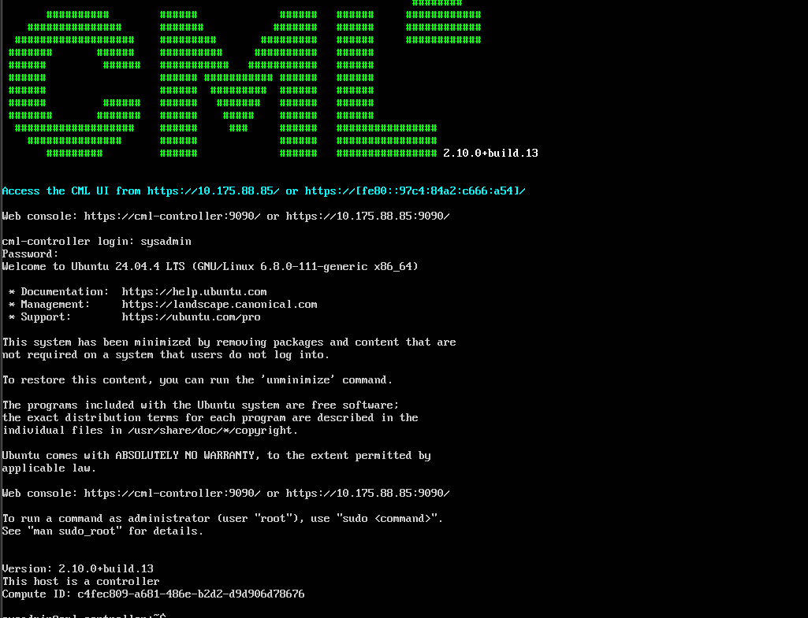
*Figure 1 — Rebuilt environment boot banner*

---

## 4. Issue Encountered: Interface Naming Mismatch

The first VLAN configuration attempt used `e0/0`, copying the interface naming from Lab 01's IOL-L2 switches. IOS rejected it outright:

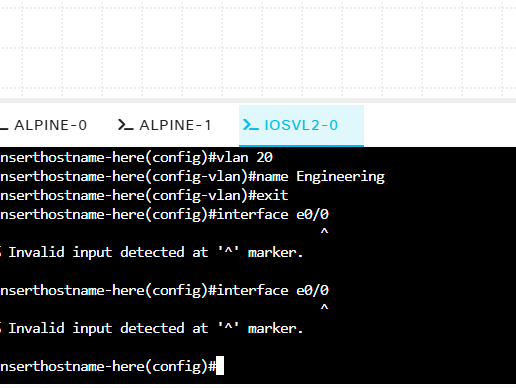
*Figure 2 — Wrong interface name rejected*

The topology diagram itself confirmed the actual interface names for this platform — G0/0 for each host-facing port, G0/1 for the inter-switch link — different from IOL-L2's Et0/x naming used previously.

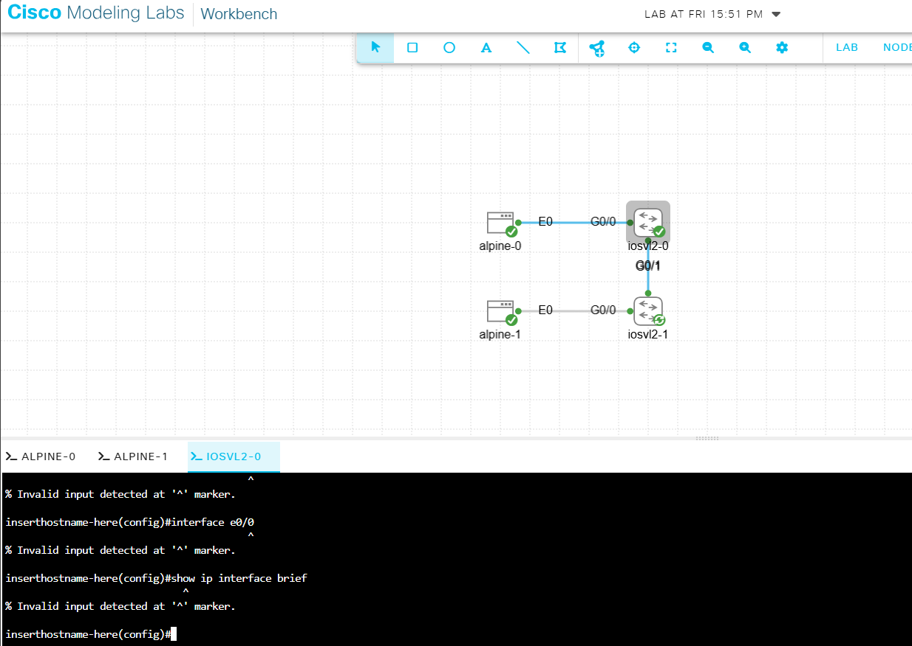
*Figure 3 — Confirmed interface names from topology*

Confirmed directly with `show ip interface brief` before proceeding, rather than assuming:

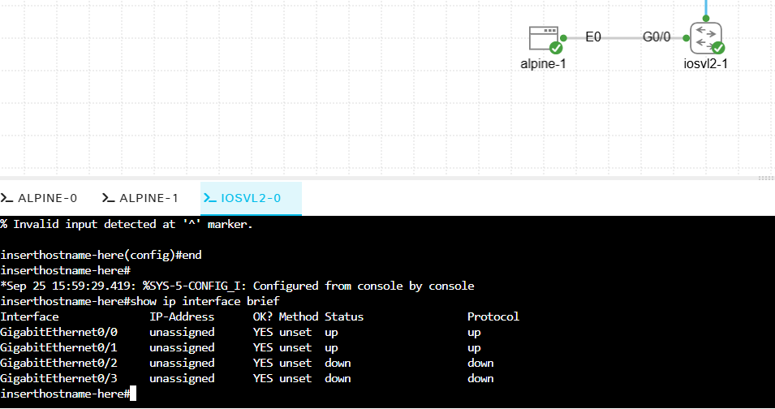
*Figure 4 — Confirmed with show ip interface brief*

> **Lesson:** interface naming is platform-specific (IOL-L2 uses `Ethernet0/x`, IOSv L2 uses `GigabitEthernet0/x`) — check `show ip interface brief` on an unfamiliar node rather than assuming a naming convention from a previous lab.

---

## 5. VLAN and Trunk Configuration

### 5.1 iosvl2-0 (alpine-0's switch — VLAN 10 side)

VLANs were created successfully on the first attempt. A capitalized `show interfaces Trunk` command failed (IOS commands are case-sensitive in this context), and shortly after, a stray `end` typed at the top-level exec prompt (rather than from within a lower configuration mode) was interpreted as a hostname and sent the console into a hung DNS lookup against a nonexistent host named "end":

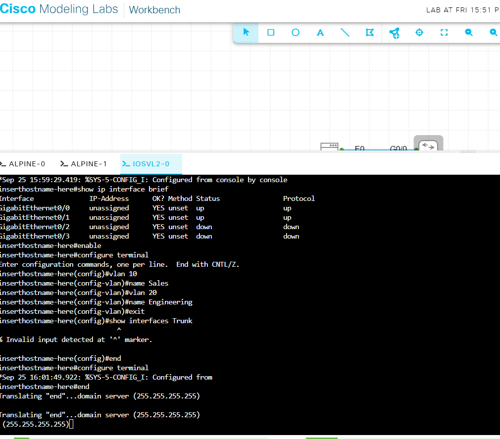
*Figure 5 — Hung console from a stray command*

Ctrl+C cleared the hung lookup. No configuration was lost — the VLAN creation had already committed before the stray command.

Final working configuration for iosvl2-0:

```
enable
configure terminal
vlan 10
name Sales
exit
vlan 20
name Engineering
exit
interface g0/0
switchport mode access
switchport access vlan 10
exit
interface g0/1
switchport trunk encapsulation dot1q
switchport mode trunk
end
```

### 5.2 iosvl2-1 (alpine-1's switch — VLAN 20 side)

The first attempt to set trunk mode on G0/1 without first setting an encapsulation was rejected:

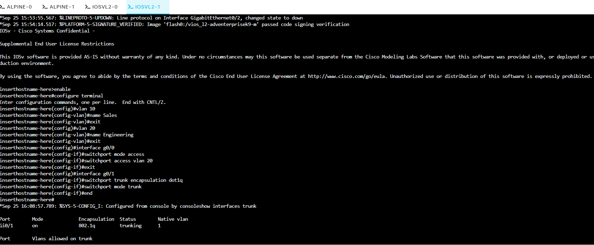
*Figure 6 — Trunk mode rejected*

This switch platform supports multiple trunking encapsulations and defaults to "Auto," which will not accept trunk mode until an explicit encapsulation is set. Adding `switchport trunk encapsulation dot1q` before `switchport mode trunk` resolved it immediately — confirmed by `show interfaces trunk` showing G0/1 trunking with VLANs 1, 10, and 20 active:

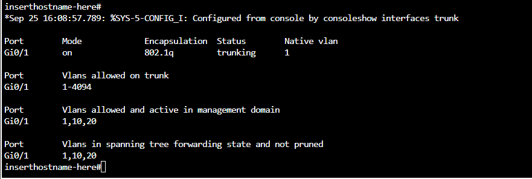
*Figure 7 — Trunk confirmed after fix*

Final working configuration for iosvl2-1 (identical structure, VLAN 20 on the access port instead of VLAN 10):

```
enable
configure terminal
vlan 10
name Sales
exit
vlan 20
name Engineering
exit
interface g0/0
switchport mode access
switchport access vlan 20
exit
interface g0/1
switchport trunk encapsulation dot1q
switchport mode trunk
end
```

> **Lesson:** on switches whose trunk encapsulation defaults to Auto, run `switchport trunk encapsulation dot1q` before `switchport mode trunk` — issuing them in the wrong order produces a hard rejection, not a warning.

### 5.3 Verification on iosvl2-0

The same VLAN and trunk configuration was applied to iosvl2-0 (this time without the earlier command errors), confirmed with a clean `show interfaces trunk` output matching iosvl2-1's:

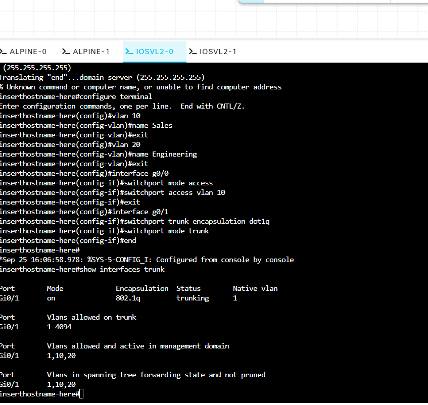
*Figure 8 — iosvl2-0 trunk confirmed*

Both switches now show G0/1 trunking, 802.1Q encapsulation, with VLANs 1, 10, and 20 active and forwarding — the trunk itself is confirmed working before any host-to-host test.

---

## 6. Connectivity Test: Different VLANs

With alpine-0 in VLAN 10 and alpine-1 in VLAN 20, addresses were assigned and a ping was attempted across the trunk:

```
sudo ip addr add 192.168.1.10/24 dev eth0
ping 192.168.1.11
```

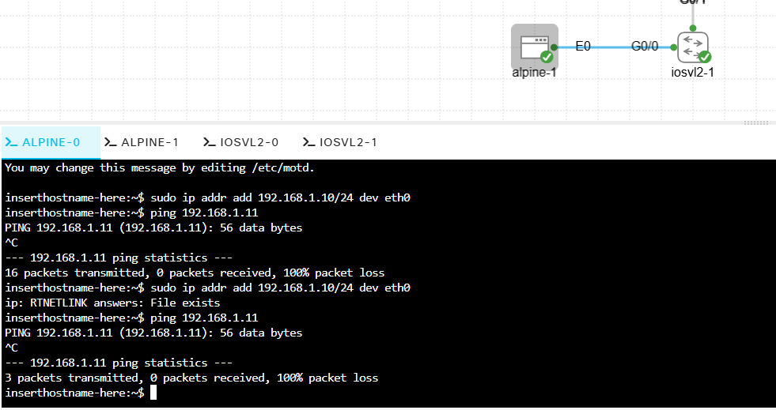
*Figure 9 — 100% packet loss between VLANs*

**Result: 100% packet loss — and this is the correct, expected outcome, not a fault.** VLAN 10 and VLAN 20 are separate broadcast domains. The trunk between the switches carries both VLANs' traffic side by side, but nothing in this topology performs inter-VLAN routing (no Layer 3 device or routed SVI is configured), so a host in one VLAN has no path to a host in the other despite the physical link between their switches being fully up and trunking correctly. This is the concrete demonstration of VLAN-based segmentation.

---

## 7. Proving the Contrast: Same VLAN, Same Wiring

To make the segmentation concrete, alpine-1's access port was moved from VLAN 20 into VLAN 10 — the only change made, with no rewiring:

```
configure terminal
interface g0/0
switchport access vlan 10
end
```

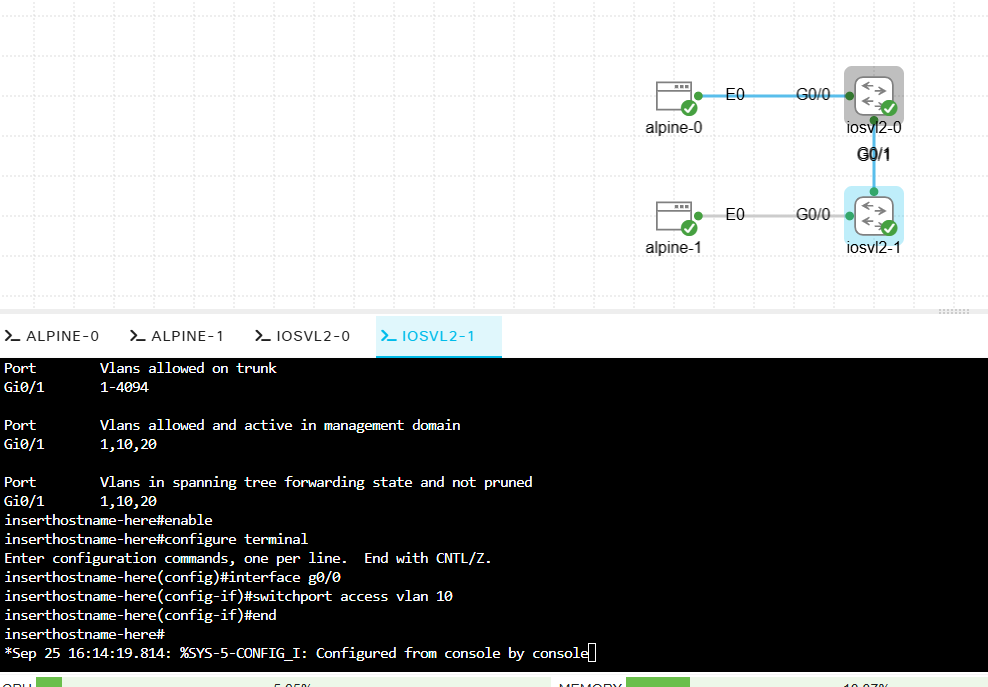
*Figure 10 — Moving alpine-1 into VLAN 10*

An immediate retry of the ping from alpine-0 still failed:

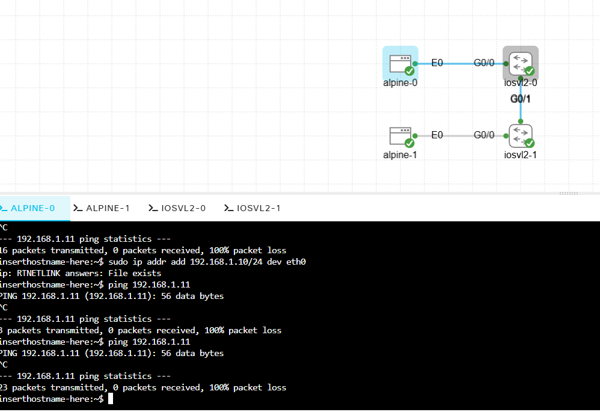
*Figure 11 — Still failing immediately after the change*

This was a timing issue, not a configuration problem. Changing a switch port's VLAN triggers Spanning Tree Protocol to re-run its port-state transition (listening → learning → forwarding) before the port resumes forwarding traffic, which by default can take 15–30+ seconds. Waiting roughly 30 seconds and retrying the same ping succeeded fully.

**Result:** with both hosts in VLAN 10, ping succeeded end to end across the identical physical topology that had produced 100% loss minutes earlier. VLAN membership, not the cable, determined connectivity — the intended lesson of the lab, now demonstrated in both directions (segmented and unsegmented) on the same hardware.

---

## 8. What I Learned

- Interface naming is platform-specific — IOL-L2 uses `Ethernet0/x` (`e0/0`), IOSv L2 uses `GigabitEthernet0/x` (`g0/0`). Confirm with `show ip interface brief` rather than assuming based on a previous lab's platform.
- IOS commands are case-sensitive at the keyword level in some contexts — `show interfaces Trunk` (capital T) was rejected where `show interfaces trunk` succeeded.
- A command typed at the wrong prompt level can be misinterpreted rather than simply rejected — a stray `end` at the top-level exec prompt was parsed as a hostname and triggered a hanging DNS lookup. Ctrl+C recovers cleanly; no configuration is lost by the mistake itself.
- On switches with configurable trunk encapsulation, `switchport mode trunk` fails outright when encapsulation is still "Auto" — set `switchport trunk encapsulation dot1q` first.
- VLAN segmentation is real, not just theoretical: two hosts on a fully-trunked link genuinely cannot reach each other across different VLANs without a Layer 3 device — confirmed by deliberately reproducing both the failure and the fix on identical wiring.
- A VLAN reassignment on a live switch port takes visible time to converge (STP re-transition) — a ping that fails in the first few seconds after a VLAN change is not necessarily evidence of a misconfiguration; wait and retry before troubleshooting further.
- When a lost admin password blocks the CML web UI and the sysadmin console account is also unrecoverable, a clean OVA reimport is a faster and more reliable recovery path than attempting a Linux-level password reset inside the VM console — write down both credentials the moment they're set to avoid the rebuild entirely.

---

## 9. Quick Reference

| Command | Purpose |
|---|---|
| `vlan <id>` / `name <name>` | Create a VLAN and label it |
| `switchport mode access` | Set a port as a single-VLAN access port |
| `switchport access vlan <id>` | Assign an access port to a specific VLAN |
| `switchport trunk encapsulation dot1q` | Set 802.1Q encapsulation (required before trunk mode on some platforms) |
| `switchport mode trunk` | Set a port to carry multiple VLANs as a trunk |
| `show vlan brief` | List VLANs and their assigned access ports |
| `show interfaces trunk` | Confirm trunk status, encapsulation, and active VLANs on a port |
| `show ip interface brief` | Check real interface names and up/down status on an unfamiliar platform |

---

## 10. Next Lab

**Lab 03 — Inter-VLAN Routing** (Week 3–4): add a router-on-a-stick or routed SVI to this same topology so that alpine-0 (VLAN 10) and alpine-1 (VLAN 20) can reach each other through Layer 3 routing, without merging them back into a single VLAN — directly building on the segmentation demonstrated here.
